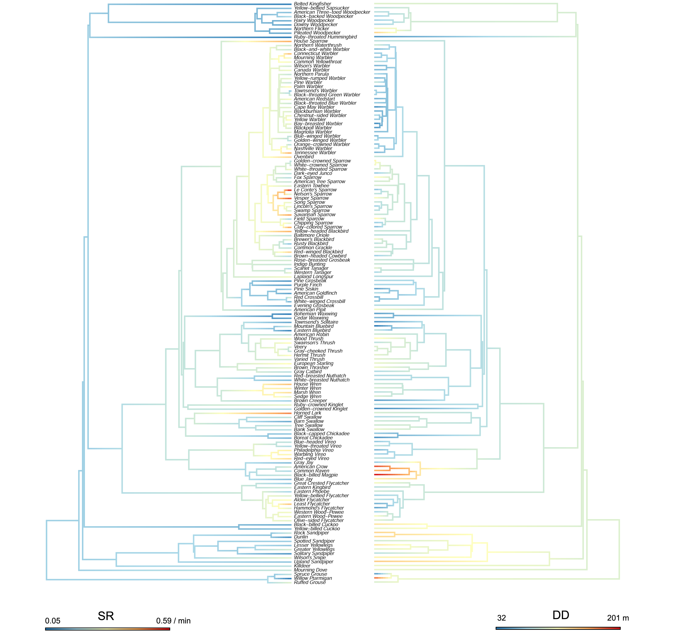

# lhreg: Phylogeny and species trait effects on detectability

[](https://travis-ci.org/borealbirds/lhreg)
[](https://doi.org/10.5281/zenodo.918321)
[](https://www.gnu.org/licenses/old-licenses/gpl-2.0.en.html)

The **lhreg** R extension package is a supporting material for the manuscript by Solymos et al. (see Citation)
The package contains the (1) data, (2) analysis code used in the manuscript,
and (3) code required to summarize the results and produce tables and figures.

### Versions

The R package is hosted on [GitHub](https://github.com/borealbirds/lhreg),
Please submit issues [here](https://github.com/borealbirds/lhreg/issues).

The package is archived on Zenodo with DOI [10.5281/zenodo.596410](http://doi.org/10.5281/zenodo.596410).

### Install

The package can be installed as:

```{r install,eval=FALSE}
devtools::install_github("borealbirds/lhreg")
```

The supporting information with reproducible code can be viewed as:

```{r vignette,eval=FALSE}
vignette(topic = "lhreg", package = "lhreg")
```

### Citation

Peter Solymos, Steven M. Matsuoka, Diana Stralberg, Nicole K. S. Barker, and Erin M. Bayne, *in press*.
Phylogeny and species traits predict songbird detectability.
[*Ecography*](http://onlinelibrary.wiley.com/journal/10.1111/(ISSN)1600-0587), DOI [10.1111/ecog.03415](http://dx.doi.org/10.1111/ecog.03415).



The figure above shows singing rates (SR)
and detection distances (DD) along a 
phylogenetic tree for the 141 bird species used in the study.
